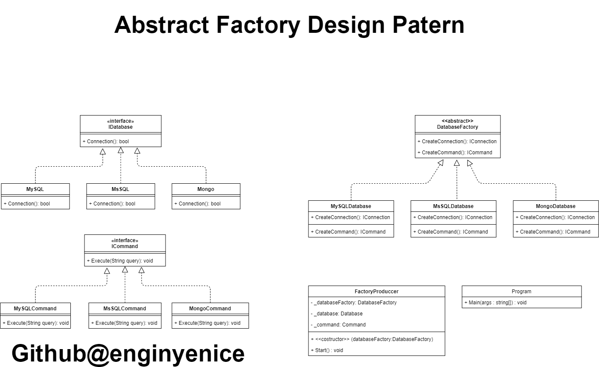

## Abstract Factory Design Pattern Nedir?
Abstract factory design pattern’i anlatırken ister istemez Factory design pattern’ine de değinmiş olacağız. 

Factory design pattern’de tek bir ürün ailesine ait tek bir arayüz mevcutken,abstract factory’de farklı ürün aileleri için farklı arayüzler mevcuttur. 

Fabrika olarak düşünürsek, Factory DP sadece tek bir ürünün üretildiği fabrika, Abstract Factory DP ise farklı farklı ürünlerin üretildiği fabrika olarak düşünebiliriz.

## Abstract Factory Ne Zaman Kullanılır?

Birden fazla ürün ailesi ile çalışmak durumunda kaldığımızda , ürün ailesi ile istemci tarafını soyutlamak için kullanılır.

Ürün ailelerinin oluşumunu istemci tarafından ayırarak, karar verme koşulu olmadan, esnek ve geliştirilebilir bir yapı kurmamızı sağlar.