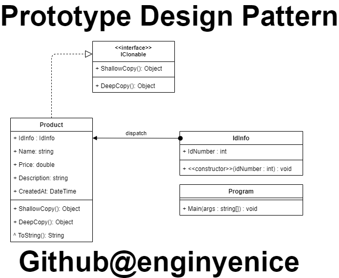

Bazen nesnelerimizi yeniden oluşturmak çok uzun gelebilir. Özellikle Constructor ları olan ya da içine belirli değerler almış nesnelerin kopyalanması bize yeni bir nesne oluşturmaktan çok daha fazla zaman tasarrufu sağlayabilir. Tabi bu durumda kopyalamak istediğimiz değişkenin Reference Tip olması biraz işlerimizi karıştırır.

Bu başlık altında sizlere Prototype Pattern ile bu sorunu nasıl ortadan kaldıracağımızı, değişkenlerimizi sağlıklı olarak nasıl kopyalayacağımızı anlatacağım.
Prototype pattern, değişkenlerimizde kopyalama yaparken “=” operatörü kullanmak yerine Shallow ya da Deep copy ile klon oluşturmamızı sağlayan ve bu sayede kopyalardan birinde bir değişiklik yapıldığında, diğer kopyaların da değerlerinin, özelliklerinin değişmesini engeller.

Yaptığımız projemizde nesnemizi birden fazla oluşturmamız gerektiğinde normalde “new” olarak oluşturmak yerine bir tane oluşturduğumuz nesnemizin klonunu oluşturmamızı sağlayan bir design patterndir.

Prototype Pattern kullanılmasının amacı üretilen nesnenin çok kaynak tüketmesi durumunun engellenmesini sağlamaktır.

Prototype tasarım deseninde 3 temel yapı vardır. Bunlar:

**Soyut prototip:** Kopyalanarak kullanılmak istenen nesneler için temel oluşturacak, içinde kopyalama işlemi için özet bir metot bulunduran abstract class’tır. Bu yapı interface veya abstract class olabilir. İhtiyaca göre hangisinin olacağına karar verilir.

**Somut prototip:** Uygulamada, kopyalanması istenen gerçek nesnelerdir. Bu nesneler, soyut prototipte var olan özet metodun extends edilmesiyle (kalıtımıyla) kopyalanırlar.

**Client Uygulama:** Somut prototip nesnelerinden birer eleman elde edecek olan sınıf, metot veya bir elemandır.